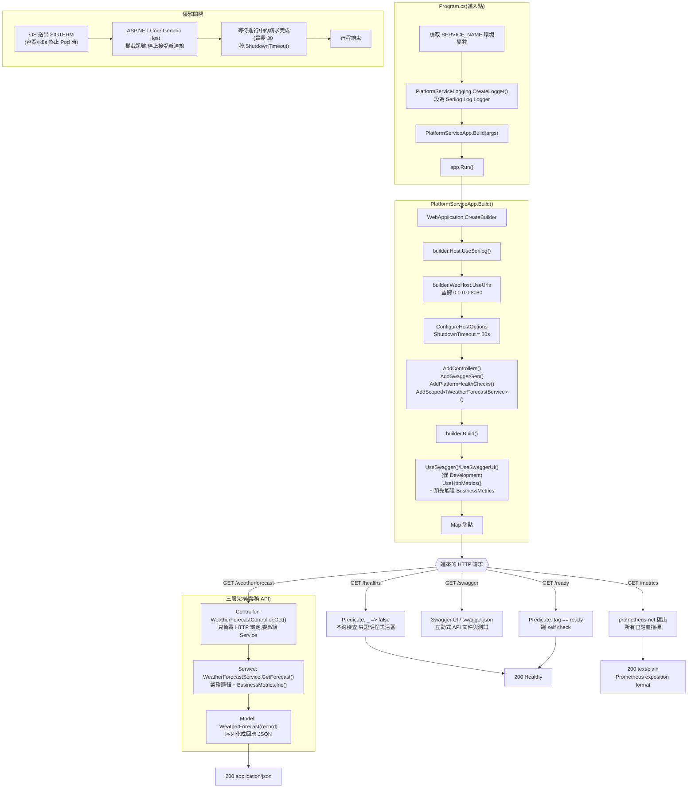

# PlatformService

ASP.NET Core (.NET 8) 生產就緒範例服務,提供結構化日誌、liveness/readiness 健康檢查、Prometheus 指標,以及優雅關閉。專案位於 `app/src`,以 `PlatformService.sln` 串接主專案與測試專案。

## 目錄結構

```
app/
├── .gitignore
├── README.md                          # 本文件
└── src/
    ├── PlatformService.sln            # 方案檔,包含以下兩個專案
    │
    ├── PlatformService/               # 主專案(可執行的 Web API,namespace 皆為 PlatformService.*)
    │   ├── PlatformService.csproj
    │   ├── Program.cs                 # 進入點:設定 Serilog 靜態 logger、呼叫 PlatformServiceApp.Build() 並 Run()
    │   ├── PlatformServiceApp.cs      # 組裝 WebApplication:middleware、健康檢查、Swagger、/metrics、MapControllers
    │   ├── PlatformServiceLogging.cs  # Serilog logger 工廠(輸出單行 JSON,可注入 TextWriter 供測試擷取)
    │   │
    │   ├── Controllers/                # Controller 層:只負責 HTTP 綁定與回應,不寫業務邏輯
    │   │   └── WeatherForecastController.cs
    │   ├── Services/                   # Service 層:業務邏輯 + 指標
    │   │   ├── IWeatherForecastService.cs
    │   │   ├── WeatherForecastService.cs
    │   │   └── BusinessMetrics.cs      # 自訂 Prometheus Counter
    │   ├── Models/                     # Model 層:資料結構
    │   │   └── WeatherForecast.cs
    │   │
    │   ├── appsettings.json
    │   ├── appsettings.Development.json
    │   ├── PlatformService.http       # VS/Rider 內建 REST client 用的手動測試腳本
    │   └── Properties/
    │       └── launchSettings.json
    │
    └── PlatformService.Tests/         # xUnit 測試專案
        ├── PlatformService.Tests.csproj
        ├── xunit.runner.json          # parallelizeTestCollections:false(見下方「測試」章節說明)
        ├── Unit/                      # 不啟動完整 host 的單元測試
        │   ├── LoggingTests.cs
        │   ├── HealthCheckSetupTests.cs
        │   ├── BusinessMetricsTests.cs
        │   ├── HostConfigurationTests.cs
        │   ├── WeatherForecastTests.cs
        │   ├── WeatherForecastServiceTests.cs      # 直接測 Service 層,不經過 HTTP
        │   └── WeatherForecastControllerTests.cs   # 用假的 IWeatherForecastService 單獨測 Controller 層
        └── Integration/                # 啟動真實 host(WebApplicationFactory 或真 Kestrel)的整合測試
            ├── HealthEndpointsTests.cs
            ├── MetricsEndpointTests.cs
            ├── WeatherForecastEndpointTests.cs
            └── HostBindingTests.cs
```

## 架構與請求流程



## 五個生產介面

| # | 功能 | 實作重點 | 對應檔案 |
|---|------|----------|----------|
| 1 | 結構化日誌 | Serilog + `CompactJsonFormatter` 輸出單行 JSON 到 stdout;`Enrich.WithProperty("service", ...)` 讀 `SERVICE_NAME` 環境變數(預設 `platform-service`) | `PlatformServiceLogging.cs` |
| 2 | 健康檢查分離 | `/healthz`(liveness)用 `Predicate = _ => false` 不跑任何檢查,只證明程式活著;`/ready`(readiness)用 tag `"ready"` 篩選要跑的檢查,確認能接流量 | `PlatformServiceApp.cs`(`HealthCheckSetup`) |
| 3 | Prometheus 指標 | `prometheus-net.AspNetCore` 的 `UseHttpMetrics()` + `MapMetrics("/metrics")`;自訂業務計數器 `platformservice_requests_processed_total`,在 Service 層的 `GetForecast()` 被呼叫時遞增,啟動時就預先註冊避免計數器要等第一次呼叫才出現 | `Services/BusinessMetrics.cs`、`Services/WeatherForecastService.cs` |
| 4 | 監聽位址 | `builder.WebHost.UseUrls("http://0.0.0.0:8080")`,監聽所有網卡的 8080 埠(容器化部署必需) | `PlatformServiceApp.cs` |
| 5 | 優雅關閉 | `ConfigureHostOptions(o => o.ShutdownTimeout = TimeSpan.FromSeconds(30))`,搭配 .NET Generic Host 內建的 SIGTERM 處理,讓進行中的請求在 30 秒內跑完才真正結束行程 | `PlatformServiceApp.cs` |

## 三層架構(Controller / Service / Model)+ Swagger

業務 API(目前是 `/weatherforecast`)採用標準三層式架構,`/healthz`、`/ready`、`/metrics` 屬於基礎設施端點,維持用 middleware 掛載(不放進 Controller):

- **Controller**(`Controllers/WeatherForecastController.cs`):`[ApiController]` + `[Route("[controller]")]`,只負責接收 HTTP 請求、呼叫注入的 `IWeatherForecastService`、包成 `ActionResult` 回傳,不含任何業務邏輯。
- **Service**(`Services/IWeatherForecastService.cs` / `WeatherForecastService.cs`):實際業務邏輯(產生預報資料、遞增 `BusinessMetrics` 計數器),用介面 + `builder.Services.AddScoped<IWeatherForecastService, WeatherForecastService>()` 走依賴注入,方便測試時替換成假實作。
- **Model**(`Models/WeatherForecast.cs`):純資料結構(record),不含邏輯,作為 API 的請求/回應 DTO。

**Swagger**:`AddEndpointsApiExplorer()` + `AddSwaggerGen()` 會自動掃描 Controller 上的路由與型別產生 OpenAPI 文件,開發環境(`IsDevelopment()`)下掛載 `UseSwagger()` + `UseSwaggerUI()`。啟動後開啟 `http://localhost:8080/swagger` 即可在網頁上直接對 `/weatherforecast` 送測試請求、查看請求/回應結構(`WeatherForecast` model 的 schema 會自動列出),不需要另外寫 curl 指令做 API 驗證。

## 使用套件

### PlatformService(主專案)

| 套件 | 版本 | 用途 |
|------|------|------|
| `Microsoft.AspNetCore.OpenApi` | 8.0.26 | Minimal API 的 OpenAPI 中介層(供 Swagger 使用) |
| `Swashbuckle.AspNetCore` | 6.6.2 | 開發環境下的 Swagger UI(僅 `IsDevelopment()` 時掛載) |
| `Serilog.AspNetCore` | 10.0.0 | 把 ASP.NET Core 的內建 logging 導向 Serilog,並提供 `UseSerilog()` |
| `Serilog.Formatting.Compact` | 3.0.0 | `CompactJsonFormatter`,產生單行 JSON 日誌 |
| `prometheus-net.AspNetCore` | 8.2.1 | `/metrics` 端點、HTTP 請求內建指標、自訂 Counter |

### PlatformService.Tests(測試專案)

| 套件 | 版本 | 用途 |
|------|------|------|
| `xunit` | 2.5.3 | 測試框架 |
| `xunit.runner.visualstudio` | 2.5.3 | 測試執行器(供 `dotnet test` / IDE 使用) |
| `Microsoft.NET.Test.Sdk` | 17.8.0 | .NET 測試 SDK |
| `Microsoft.AspNetCore.Mvc.Testing` | 8.0.15 | 提供 `WebApplicationFactory<Program>`,啟動 in-memory `TestServer` 做整合測試 |
| `coverlet.collector` | 6.0.0 | 程式碼覆蓋率收集 |

## 測試

26 個測試,五個生產介面 + 三層架構各自都有單元測試 + 整合測試涵蓋:

| 功能 | 單元測試(`Unit/`) | 整合測試(`Integration/`) |
|------|---------------------|----------------------------|
| 日誌 JSON + service 欄位 | `LoggingTests` | — (經由整合測試的請求日誌間接驗證) |
| `/healthz` vs `/ready` | `HealthCheckSetupTests` | `HealthEndpointsTests` |
| `/metrics` + 自訂計數器 | `BusinessMetricsTests` | `MetricsEndpointTests` |
| 監聽 0.0.0.0:8080 | `HostConfigurationTests` | `HostBindingTests`(真 Kestrel,動態連接埠) |
| 優雅關閉 | `HostConfigurationTests` | `HostBindingTests` |
| Model(`WeatherForecast`) | `WeatherForecastTests` | — |
| Service(`WeatherForecastService`) | `WeatherForecastServiceTests` | — |
| Controller(`WeatherForecastController`) | `WeatherForecastControllerTests`(注入假 Service) | `WeatherForecastEndpointTests`(真的走 HTTP → Controller → Service) |

執行方式:

```bash
cd app/src
dotnet build PlatformService.sln
dotnet test PlatformService.sln
```

**為什麼要關閉平行測試(`xunit.runner.json` 的 `parallelizeTestCollections: false`)**:自訂計數器 `BusinessMetrics.RequestsProcessed` 是 prometheus-net 全域 registry 中的靜態物件,多個測試類別若平行執行會互相干擾計數結果(以及啟動多個 host 搶用資源),因此關閉跨 collection 的平行執行,讓測試在同一個行程內依序、決定性地跑完。

## 執行方式

```bash
cd app/src/PlatformService
SERVICE_NAME=platform-service ASPNETCORE_ENVIRONMENT=Development dotnet run
```

啟動後可用以下方式驗證(對應需求 2、3):

```bash
curl http://localhost:8080/healthz
curl http://localhost:8080/ready
curl http://localhost:8080/metrics
curl http://localhost:8080/weatherforecast
```

開發環境下也可以直接用瀏覽器打開 Swagger UI 互動測試:`http://localhost:8080/swagger`
